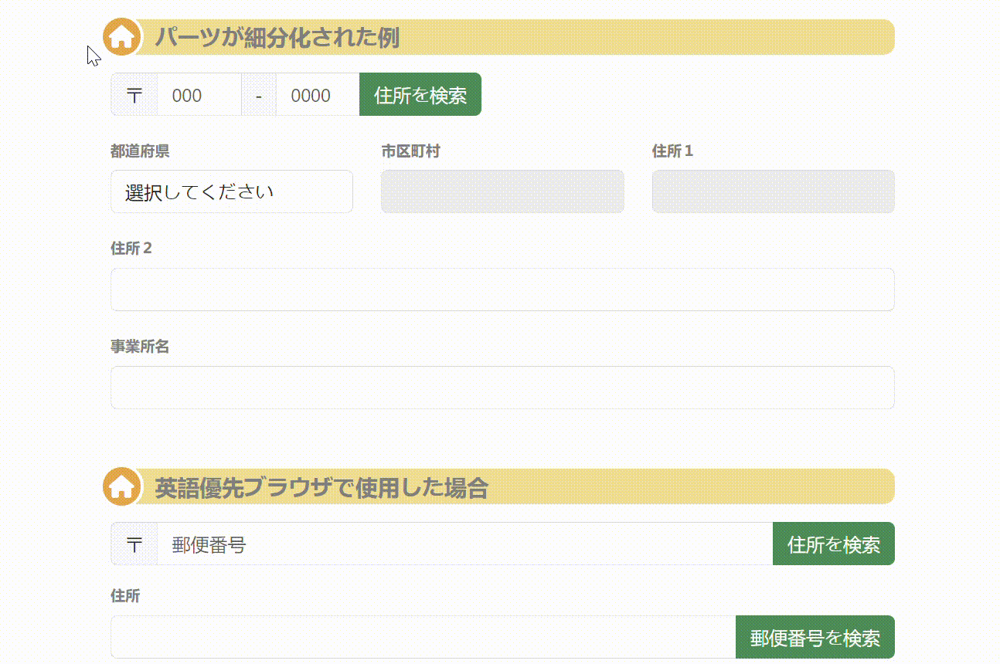

# 陽気に郵便番号検索 [Web]

## 陽気に郵便番号検索とは

**陽気に郵便番号検索** は C# .NET で作られた、日本郵便の全国郵便番号データをを元に、
データの整形とデータのXMLファイルへの変換・保存、検索機能のライブラリ、
HTMLフォーム上での住所入力アシストなどをセットした開発プロジェクトのパッケージです。

- [陽気に郵便番号検索 [Web]](https://github.com/JakeJP/YZipCode.Web) **※本バージョン**
  既存のHTMLフォームに簡単に郵便番号検索・住所検索機能を追加するための Javascript ライブラリ。

- [陽気に郵便番号検索 [SDK]](https://github.com/JakeJP/YZipCode.SDK)
  一連のソースコードと開発環境を公開しています。



## Web バージョン

**陽気に郵便番号検索 [Web]** は、ウェブデザイナーが郵便番号・住所入力をする既存のウェブフォームに簡単に入力補助機能を追加する方法を提供します。

特徴

- 既存の様々な 郵便番号・住所入力 HTMLフォームに入力補助機能を追加
- プログラミング不要。JavascriptとCSSファイルの参照と、数行の初期化処理の追加のみで実装可能
- 郵便番号⇔住所入力 相互の検索・サジェスト・自動補完
- 郵便番号データはクラウド上で管理（サーバー不要）
- 郵便番号データは常に最新（メンテナンスフリー）

このリポジトリにはプログラムコードは含まれていません。既存のHTMLに機能を追加する方法を以下に解説しています。

※自前で郵便番号データの管理（データ作成）とWebAPIサーバーを立ち上げたい場合はSDKを参照してください。

### Web 版 ウェブフォームウィジェットの機能

- 郵便番号 → 住所 の検索・サジェスト・自動補完
- 住所 → 郵便番号 の検索・サジェスト・自動補完

Javascript のウィジェットは、既存のHTMLフォームに適用されます。

**検索** 機能はボタンコントロールによってトリガーされ検索結果を一覧、またはフォームに直接挿入します。

**サジェスト** 機能はユーザーがフォームを入力中、可能な候補を一覧で提示します。

**自動補完** はユーザーの入力の過程で適合する結果が１つになった場合に、自動的にフォームに挿入します。

## 動作サンプル

実際の[動作サンプルはこちら](https://www.yzipcode.yo-ki.com/Sample) を御覧ください。

## 導入方法

### 前提条件

- HTML で書かれた住所入力用のフォームが対象です。javascript と
  スタイルシート読み込みのタグ、初期化のための数行の javascript を挿入できればフレームワークは問いません。

### 1. javascript と css スタイルシートの参照をページ内に追加します。

通常は `head` タグ内に記述を追加します。

```html
<script src='https://yzipcode.yo-ki.com/js/yokinsoft.zipcode.min.js'></script>
<link rel="stylesheet" type="text/css" href="https://yzipcode.yo-ki.com/css/yokinsoft.zipcode.min.css" />
```

### 2. 導入したいウェブフォームを選定します。

この javascript ライブラリは様々な形式の住所入力フォームに対応することが可能です。
ここでは、例として次のような住所入力フォームがあるとします。(スタイルに Bootstrapの記述を使っています)

```html
<form id="sampleForm1">
    <div class="input-group mb-3">
        <div class="input-group-text">〒</div>
        <input autofocus name="zipcode" placeholder="郵便番号" autocomplete="off" autofill="false" class="form-control" />
        <input type="button" class="btn btn-success" value="住所を検索" />
    </div>
    <div>
        <div class="row">
            <label class="form-label">住所</label>
            <div class="">
                <input name="address" class="form-control" />
            </div>
        </div>
        <div class="mb-3">
            <label for="sample0-business" class="form-label">事業所名</label>
            <input name="business" class="form-control yz-address-business-name" />
        </div>
    </div>    
</form>
```

フォームの中から

- 郵便番号を入力する要素
- 住所を入力する要素
- 事業所名を入力する要素

を決めます。要素は1つだけの テキストボックス の場合や複数の テキストボックスから構成される場合もあります。

初期化プログラムの記述で、要素の指定は Javascript の querySelector が認識する書式か要素のIDそのものを使います。
この例では input 要素にIDはついていないので、form の id を使って特定する方法を取ります。
要素の指定は css でおなじみの指定方法です。idの指定は `#` から始まる文字列, input 要素をそれぞれ指定します。
郵便番号欄は `#sampleForm1 input[name=zipcode]` , 住所欄は `#sampleForm1 input[name=address]`, 事業所欄は
`#sampleForm1 input[name=business]` となります。

### 3. ウィジェットの初期化の Javascript を記述します。

検索機能を有効にするフォーム要素を指定して、`YZipCode` クラスを初期化します。

`YZipCode` クラスを初期化します。初期化の場所は、指定するフォームの後、またはフレームワークなどを使ってページ全体が初期化された後に
実行される部分に挿入します。

```html
<script>
  new YZipCode({
    zipcode: ['#sampleForm1 [name=zipcode]', '#sampleForm1 [value=住所を検索]'],
    address: '#sampleForm1 [name=address]',
    business: '#sampleForm1 [name=business]'
  });
</script>
```

この例では郵便番号部分は２つの INPUT 要素で構成されるため、配列を使います。住所部分は１つの INPUT 要素のみなので 文字列 で指定します。

以上で、郵便番号検索ウィジェットは有効になりました。
さらに詳しいオプションなど設定方法は以下の詳細を参照してください。

---

## 利用規約・ライセンス

2024年現在このシステムは商用・非商用問わず、無償で利用いただけます。
無償、匿名での利用はパフォーマンス、UI、利用限度などいくつかの制限が付きます。
有料プランを含め複数の利用形態を用意しています。

詳細と手続きについては

 [「陽気に郵便番号検索」のポータルサイト](https://www.yzipcode.yo-ki.com)
 
  を御覧ください。

## ライセンス（アクセスキー）の設定方法

ここでは、[「陽気に郵便番号検索」のポータルサイト](https://www.yzipcode.yo-ki.com) で手続きを行った後取得できるアクセスキーの設定方法について解説します。

1. アクセスキーの発行を行い、アクセスキーの記述を YZipCode の初期化部分に `apiAuth` への設定を追加します。
2. Origin 設定で、HTMLフォームを設置したウェブサイトのドメインを `https://www.example.com` の形式で登録します。※URLのうち、パス以下を省略した形式に注意してください。

例）

```html
<script>
  YZipCode.apiAuth = 'XXXXXXXXXXX:YYYYYYYYY';
  new YZipCode({
    zipcode: ['#sampleForm1 [name=zipcode]', '#sampleForm1 [value=住所を検索]'],
    address: '#sampleForm1 [name=address]',
    business: '#sampleForm1 [name=business]'
  });
</script>
```

#### アクセスキーと 許可Origin の管理

本システムではアクセスキーとOrigin制限を元にアクセス数を集計しています。これらは、HTMLページ内に公開された情報となり、クライアントWebブラウザからのアクセスを厳密に制限する**セキュリティ技術ではありません**。アクセス記録をより正確にするために時々アクセスキーの変更を行ってください。

### 無保証

サービスの品質（応答データの正確性など）、サービスの停止、不具合、終了、仕様変更、利用規定の変更などに関していかなる保証もいたしません。

### プライバシー

本サービスの性質上サーバーへ郵便番号、ユーザーの入力した住所の一部文字列が送信されます。
本システムではセンシティブな情報である、住所の文字列がクライアントWebブラウザーの履歴上に残らないような
仕組みを取り入れています。またサーバー上ではユーザーが入力した住所の文字列は基本的に保存されません。
ただし、統計処理に必要な関連した一部の情報が記録される場合があります。

### 独自サーバー構築の場合

高可用で、独立したサーバーを求める場合は、SDKを使って独自のサーバーを設置することをおすすめします。
独自のサーバー構築に関しては有償にてサポートが可能ですのでお問い合わせください。

## 様々なカスタマイズ

ここでは、基本的な設定オプションについて記述します。詳細に渡るカスタマイズについてはSDKのドキュメントを参照ください。

----

### 住所入力フォームの基本概念

基本要素

- 郵便番号 7桁の郵便番号は 123-4567 または 1234567 と表現されます。
- 住所 都道府県→市区町村→その他の地域→番地・建物名・部屋番号など の階層構造を持ちます。市区町村は、「市」＋「区」が合わさった形式の場合もあります。
- 事業所 郵便番号が個別に割り当てられている事業所名。javascript ライブラリでは省略することも可能です。

HTML上の要素

- 郵便番号： １つまたは２つのテキストボックス、検索実行用のボタン。ボタンは省略可能。
- 住所：　住所の構成要素の分割に応じて　１つ～４つの テキストボックス、検索実行用のボタン。都道府県の選択は SELECT も可能。ボタンは省略可能。

ボタンは明示的に検索を呼び出す場合に使用します。

### `YZipCode` オプション

#### HTMLフォーム構成要素の指定

- `zipcode` : string | `Array<string>` 郵便番号用入力フォームまたはボタン
- `address` : string | `Array<string>` 住所用入力フォームまたはボタン
- `business` : string | `Array<string>` 事業所用入力フォーム
- `rome` : string | `Array<string>` ローマ字用入力フォームまたはボタン

`INPUT`フォームなどの指定は `id` または querySelector 形式 (`#zipcode` などのcssなどのセレクタと同様)の形式。

#### 動作に関するオプション

- `autofill` : **true** | false
 郵便番号または住所文字列の入力時、住所が一意に決定する場合にフォームに自動的に文字列を挿入します。
- `autosuggest` : **true** | false 郵便番号または住所文字列の入力の際、複数の候補がある場合ドロップダウンリストでその候補を表示します。
- `autofocus` : **true** | false 入力の確定時にフォーカスを自動的に設定
- `zipcodeDelimiter` : '-' 郵便番号の桁区切り文字
- `romeDelimiter` : ',' ローマ字の区切り文字
- `romeReverse` : **false** | true ローマ字を逆順にするかどうか
- `romeCapitalize` : **false** | true  ローマ字を大文字＋小文字の表記に変更
- `language` : **'auto'** | 'ja' | 'en'  言語指定。デフォルトではブラウザの言語に依存します。

#### 例

```html
<script type="text/javascript">
    var helper = new YZipCode({
        zipcode: ['#sampleFormEng [name=zipcode]', '#sampleFormEng [value=住所を検索]'],
        address: ['#sampleFormEng [name=address]', '#sampleFormEng [value=郵便番号を検索]'],
        business: ['#sampleFormEng [name=business]'],
        autofill: true,
        autosuggest: false,
        language: 'en'
    });
</script>
```


### API 仕様

※本サービスは利用規約上有料ユーザーにのみAPIアクセスをご利用いただけます。

```javascript
var apiEndpoing = "https://yzipcode.yo-ki.com/api/lookup"
```

`httpMethod = GET | POST`

#### パラメーター

**keyword** : 検索キーワード

郵便番号、住所文字列、事業所名の全体または一部

例)
```
Host: https://yzipcode.yo-ki.com
GET /api/lookup?keyword=東京都渋谷区
Authorize: Bearer (アクセスキーのBase64エンコード)
```

#### 応答メッセージ

`Content-Type: application/json`

```json
{
  "date": "2024-05-08T04:38:02.1656663+00:00",
   "keyword": "123",
  "date-created": "2024-05-01T01:00:01.2180569+00:00",
  "date-of-utf_ken_all": "2024-04-30T07:42:22.0000000+00:00",
  "date-of-jigyosyo": "2024-04-30T07:59:01.0000000+00:00",
  "date-of-ken_all_rome": "2023-07-07T05:54:14.0000000+00:00",
  "result": [
    {
      "address": "東京都 足立区 梅田",
      "post-code": "1230851",
      "post-code5": "123",
      "jis-code": "13121",
      "address-kana": "トウキョウト アダチク ウメダ",
      "address-rome": "TOKYO TO,ADACHI KU,UMEDA",
      "end": true
    },
    {
      "business-name": "梅田公共職業安定所",
      "business-name-kana": "ウメダコウキヨウシヨクギヨウアンテイシヨ",
      "address": "大阪府 大阪市北区 梅田 １丁目２－２大阪駅前第２ビル１６階",
      "post-code": "5308567",
      "post-code5": "530",
      "jis-code": "27127",
      "address-kana": "",
      "end": true
    }
  ]
}
```

**date** : 応答メッセージの作成時刻

**keyword** 検索対象のキーワード

**date-created** 郵便番号データベースの作成・更新時刻

**date-of-xxxxxxx** データベース作成に使用した日本郵便配布の元データの日付

**result** 検索結果の配列

**address** 住所文字列。半角スペースで区切り。

**post-code** 郵便番号

**post-code5** 郵便番号５桁

**jis-code** JISコード

**address-kana** 住所のかな表記。半角スペースで区切り。

**address-rome** ろマージ表記。半角カンマで区切り。

**business-name** 事業所名

**business-name-kana** 事業所名かな

**end** true | false 住所の階層の末端まで達した場合に `true` これ以下の詳細住所がない場合。

